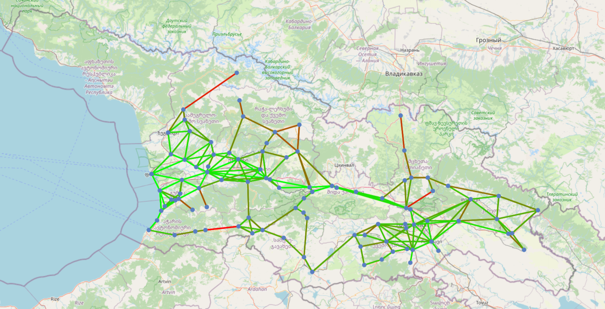

# Route Smart (v1.0-alpha) 🚚

Route Smart is a powerful algorithm designed to efficiently match senders (with parcels or autostop persons) and
shippers (with trips) in Georgia. This solution leverages graph-based pathfinding to provide optimal matches, ensuring
that parcels can find appropriate trips and vice versa.

## Table of Contents

1. [Problem Statement](#problem-statement)
2. [Solution Overview](#solution-overview)
3. [Data Model](#data-model)
4. [Pathfinding](#pathfinding)
5. [Matching](#matching)
6. [Precomputing Paths](#precomputing-paths)
7. [Querying The Results](#querying-the-results)
8. [API Endpoints](#api-endpoints)
9. [Running the Application](#running-the-application)
10. [Running the Application without docker (Not recommended)](#running-the-application-without-docker-not-recommended)
11. [Conclusion](#conclusion)

## Problem Statement 🔴

In a logistics network, we often encounter the challenge of matching parcels with trips and trips with parcels. The goal
is to ensure that parcels can be transported from their origin to their destination by finding compatible trips that
pass through their route. Similarly, trips should be able to find parcels along their path to maximize efficiency and
utilization.

## Solution Overview 💡

The solution involves several key steps:

1. **Data Model**: Representing destinations and routes as a graph.
2. **Pathfinding**: Implementing the A* search algorithm to find optimal paths.
3. **Matching**: Matching parcels with trips and trips with parcels based on the computed paths.
4. **Querying**: Efficiently querying the results to provide matches.

## Data Model 🗺️

### Destinations

The system covers major destinations in Georgia (96 in total), each represented as a node in the graph. These
destinations include cities and towns mapped with unique identifiers (1-96 Primary Key).

I assembled the map on Google Maps and then continued working on it in QGIS. I calculated complexity of the routes (by
geographical environment and road quality) and road (non-linear) distance between nodes using google maps. I exported
the map as a GeoJSON file and imported it into the database using the PostGIS extension (PostgreSQL with geospatial
capabilities).


*Map of Georgia with Destinations, Apkhazia and Samachablo is not drawn as logistics is impossible due to Russian
occupation.*

### Graph Representation

Each destination (node) is connected to other destinations via edges. These edges are weighted with the distance and
complexity of the route. The graph is represented as an adjacency list where each node has a list of tuples representing
its neighbors, the distance to them, and the complexity of the route.

```java
public class Node {
    private Long id;
    private String name;
    private Point geom; // Geometry point for location
}

public class Edge {
    private Long id;
    private Node fromNode;
    private Node toNode;
    private double distance;
    private int complexity;
    private LineString geom; // Geometry line for route
}

public class PrecomputedPath {
    private Long id;
    private Node startNode;
    private Node endNode;
    private String path; // Comma-separated sequence list of node IDs
    private double totalDistance;
    private double averageComplexity;
}
```

## Pathfinding 🧭

### A* Search Algorithm

The A* search algorithm is used to find the best possible routes from a start to an end destination. This algorithm
combines the strengths of Dijkstra's algorithm and Greedy Best-First-Search. It uses a heuristic function (Euclidean
distance) and road complexity and road (non-linear) distance from A to B constraints to estimate the cost from the
current node to the destination.

## Matching 🚚📦

### Matching Trips with Parcels

When a trip is created, the system needs to find all parcels that can be picked up along the trip's route. The algorithm
checks if the parcel's route is a subpath of any of the precomputed paths for the trip.

### Matching Parcels with Trips

Similarly, when a parcel is created, the system finds all trips that can transport the parcel along their route. The
algorithm checks if the trip's route contains the parcel's route as a subpath.

## Precomputing Paths

To optimize the matching process, the system precomputes all possible paths between destinations. This ensures that the
matching algorithm can quickly find the best possible routes without having to compute them on the fly. (Memoization)

## Querying The Results

The system uses optimized SQL queries to efficiently find matching trips and parcels. This ensures that the results are
returned quickly and accurately.

## API Endpoints

### Matching Controller

#### Match Trips with Parcels

**GET /match/trip/**

Query Parameters:

- `fromId` (Long, optional): ID of the starting node.
- `fromDisplay` (String, optional): Display name of the starting node.
- `toId` (Long, optional): ID of the ending node.
- `toDisplay` (String, optional): Display name of the ending node.
- `verbose` (Boolean, optional, default: false): Verbose flag.

Response:

- List of matching parcels.

#### Create Trip

**POST /match/trip/**

Request Body:

- `CreateTripDTO`: DTO containing `identifier`, `fromId`, and `toId`.

Response:

- `Trip`: The created trip object.

#### Match Trip with Parcels by ID

**GET /match/trip/{tripId}**

Path Parameters:

- `tripId` (Long): ID of the trip.

Query Parameters:

- `verbose` (Boolean, optional, default: false): Verbose flag.

Response:

- List of matching parcels.

#### Delete Trip

**DELETE /match/trip/{tripId}**

Path Parameters:

- `tripId` (Long): ID of the trip.

Response:

- HTTP 204 No Content.

#### Match Parcels with Trips

**GET /match/parcel/**

Query Parameters:

- `fromId` (Long, optional): ID of the starting node.
- `fromDisplay` (String, optional): Display name of the starting node.
- `toId` (Long, optional): ID of the ending node.
- `toDisplay` (String, optional): Display name of the ending node.
- `verbose` (Boolean, optional, default: false): Verbose flag.

Response:

- List of matching trips.

#### Create Parcel

**POST /match/parcel/**

Request Body:

- `CreateParcelDTO`: DTO containing `identifier`, `fromId`, and `toId`.

Response:

- `Parcel`: The created parcel object.

#### Match Parcel with Trips by ID

**GET /match/parcel/{parcelId}**

Path Parameters:

- `parcelId` (Long): ID of the parcel.

Query Parameters:

- `verbose` (Boolean, optional, default: false): Verbose flag.

Response:

- List of matching trips.

#### Delete Parcel

**DELETE /match/parcel/{parcelId}**

Path Parameters:

- `parcelId` (Long): ID of the parcel.

Response:

- HTTP 204 No Content.

## Running the Application

Here is the guide to install Docker, Docker Compose, and run your application using `docker-compose up --build`.

#### Step 1: Install Docker

#### Step 2: Install Docker Compose

#### Step 3: Preparation

1. Ensure that you have the project files (`Dockerfile`, `docker-compose.yml`, `entrypoint.sh`, `.env`, etc.) in your
   project directory.
2. Create the `.env` file in your project directory with the following content:

```plaintext
POSTGRES_DB=route_smart_db
POSTGRES_USER=routesmart_app
POSTGRES_PASSWORD=app_password
POSTGRES_HOST=db
POSTGRES_PORT=5432
```

#### Step 4: Build and Run the Application

1. Open a terminal (Command Prompt, PowerShell, or terminal in Linux/Mac).
2. Navigate to the project directory where your `docker-compose.yml` is located.
3. Run the following command to build and start the containers:

```sh
docker-compose up --build
```

This command will:

- Build the Docker images for your application and the database.
- Start the containers defined in the `docker-compose.yml` file.
- Run the necessary database seeding and precomputing steps defined in the `entrypoint.sh` script.

#### Step 3: Verify the Application

1. Once the containers are up and running, open a web browser.
2. Navigate to `http://localhost:8080` to access your application.
3. You can use the provided API endpoints to interact with the application.

#### Stopping the Application

To stop the application, press `Ctrl + C` in the terminal where the application is running. This will stop the
containers.

Alternatively, you can stop the containers using the following command in your project directory:

```sh
docker-compose down
```

This command will stop and remove the containers defined in the `docker-compose.yml` file.

## Running the Application without docker (Not recommended)

### Prerequisites

- Java 17
- Maven
- Spring Boot
- PostGIS-enabled PostgreSQL running on localhost:5432

### Running the Application with Command Line Arguments

Run the following command to start the application:

```sh
mvn spring-boot:run
```

To seed the edges and nodes (edges.geojson and nodes.geojson must be present in the resources folder):

```sh
mvn spring-boot:run -Dspring-boot.run.arguments=seed
```

To seed random parcels and trips:

```sh
mvn spring-boot:run -Dspring-boot.run.arguments=seed-dummy
```

To precompute paths (Memoization step for optimized pathfinding):

```sh
mvn spring-boot:run -Dspring-boot.run.arguments=precompute
```

## Conclusion

Route Smart is a comprehensive solution for efficiently matching parcels with trips and vice versa. By leveraging
graph-based pathfinding and optimized querying, it ensures that logistics operations are streamlined and efficient. This
system was first prototyped in Python and then implemented in Spring Boot for enhanced performance and scalability.
